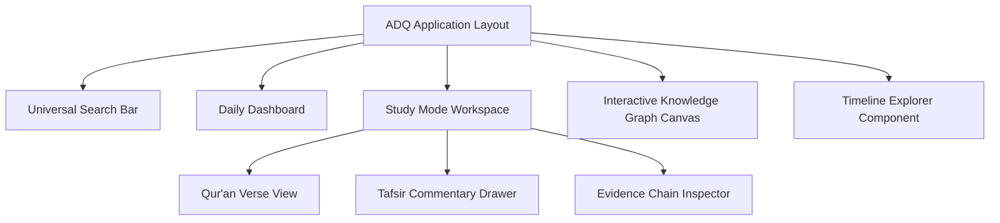

# ADQ User Experience & UI Architecture Specification

**Phase**: 10B.9 — Tafsir Knowledge Domain Integration  
**Status**: UX Blueprint Specification  
**Date**: 2026-07-23  
**Target Path**: `docs/ADQ-User-Experience-Architecture.md`

---

## 1. Core UX Pillars

1. **Universal Search**: Multi-modal search bar resolving intent to canonical concepts, verses, and Hadiths with instant autocomplete.
2. **Learning Mode**: Step-by-step guided educational walkthroughs explaining complex topics (e.g. Zakat calculation, Mirath shares, Prayer entry times).
3. **Study Mode**: Deep-dive academic workspace presenting parallel Qur'an text, Hadith citations, Tafsir commentaries, and cross-domain links.
4. **Daily Dashboard**: Personalized daily view showing prayer times, Hijri moon phase, daily Athkar, and featured Seerah timeline event.
5. **Interactive Knowledge Graph**: Canvas view allowing users to explore nodes, edges, and relationship paths dynamically.
6. **Timeline Explorer**: Chronological visual slider through Seerah events from 53 BH to 11 AH.

---

## 2. UI Component Architecture Map

