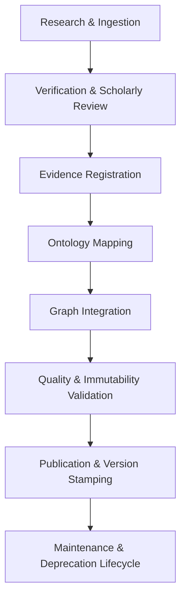

# ADQ Knowledge Governance Framework Specification

**Phase**: 10B.4C — Knowledge Governance & Content Lifecycle Framework  
**Status**: Architecture & Design Specification  
**Date**: 2026-07-22  
**Target Path**: `docs/Knowledge-Governance-Framework.md`

---

## 1. Executive Summary & Policy Statement

The **ADQ Knowledge Governance Framework** defines the overarching rules, authority standards, lifecycle stages, and verification workflows that govern all data, canonical nodes, relationships, ontology concepts, and evidence records within the Universal Knowledge Graph.

---

## 2. Core Governance Principles

1. **Primacy of Authentic Revelation**: The Qur'an (Mutawatir) and authentic Sunnah (Sahih/Hasan) form the immutable foundation.
2. **Plurality & Scholarly Attribution**: Differing juristic opinions (Madhahib) are represented as explicit contextual nodes and edges, never overwritten or erased.
3. **Traceable Evidentiary Backing**: No node or relationship may exist without a verified `EvidenceRecord`.
4. **Immutability & Version Control**: Published graph versions are immutable and stamped with semantic versioning (`vX.Y.Z`).
