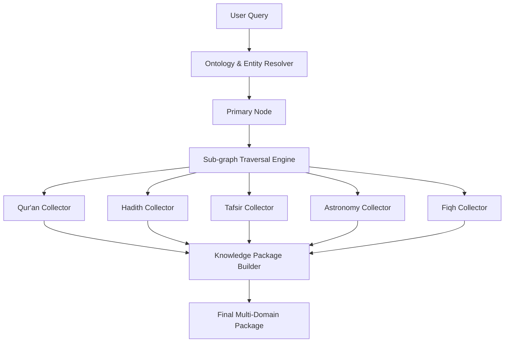

# ADQ Knowledge Package Assembly Architecture

**Phase**: 10B.9 — Tafsir Knowledge Domain Integration  
**Status**: Architecture Design Specification  
**Date**: 2026-07-23  
**Target Path**: `docs/Knowledge-Package-Architecture.md`

---

## 1. Overview & Goal

Rather than returning isolated graph nodes or uncontextualized text snippets, ADQ's Knowledge Package Engine assembles a multi-faceted, self-contained **Knowledge Package** combining all relevant domain perspectives for any query.

---

## 2. Knowledge Package Data Contract

```typescript
export interface KnowledgePackage {
  readonly query: string;
  readonly primaryConcept: string;
  readonly quranicVerses: ReadonlyArray<{ code: string; textAr: string; textEn: string }>;
  readonly hadithNarrations: ReadonlyArray<{ reference: string; textAr: string; textEn: string; grade: string }>;
  readonly tafsirExegesis: ReadonlyArray<{ mufassir: string; commentary: string }>;
  readonly fiqhJurisprudence: ReadonlyArray<{ school: string; ruling: string }>;
  readonly astronomicalMechanics?: { phenomenon: string; calculationRule: string };
  readonly historicalContext?: { event: string; year: string; place: string };
  readonly explainabilityTrail: ReadonlyArray<string>;
}
```

---

## 3. Assembling the Knowledge Package


