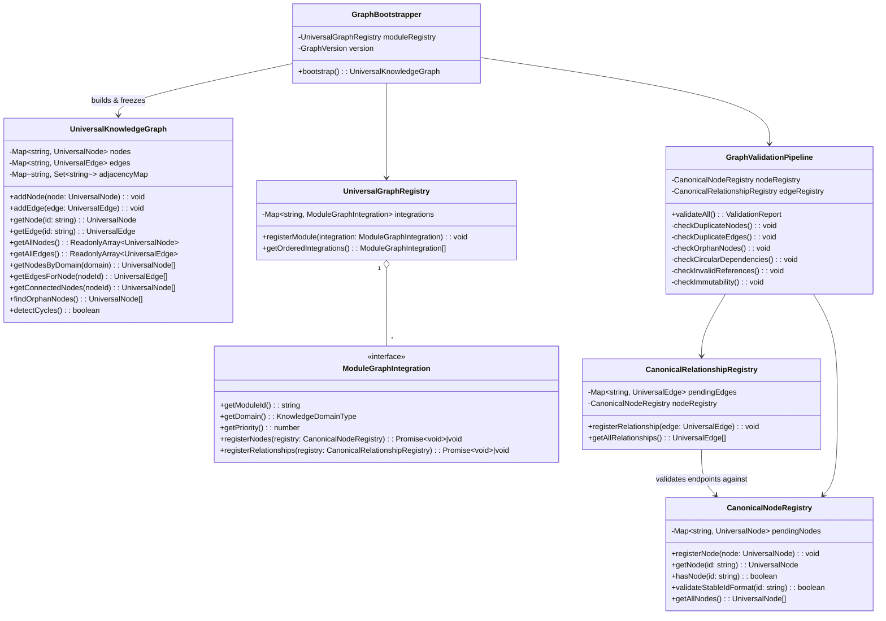
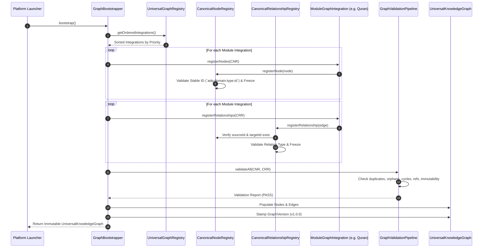
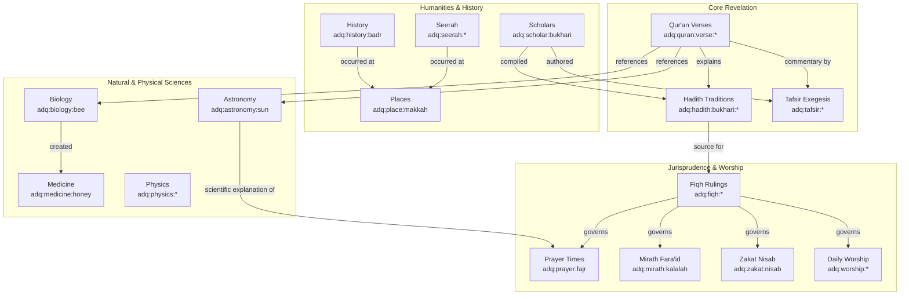

# ADQ Platform Knowledge Architecture (v1.0.0 Specification)

**Phase**: 10B.1A — Architecture Freeze & Design Review  
**Status**: Formal Specification (Documentation Only)  
**Date**: 2026-07-22  
**Target Path**: `src/platform/knowledge/`

---

## 1. Executive Summary & Core Platform Directives

The ADQ Platform Knowledge Architecture establishes a central, domain-agnostic, single source of truth for all Islamic and scientific knowledge across the ADQ platform. The Knowledge Graph is elevated from a feature component within `astronomy` to a core platform service (`src/platform/knowledge/`).

### Mandatory Platform Rules (ADR-005 Directives)

> [!IMPORTANT]
> **Rule 1: The Future Module Rule**  
> Every current and future ADQ module (Qur'an, Hadith, Tafsir, Seerah, Aqeedah, Fiqh, Mirath, Zakat, Prayer, Daily Worship, Arabic, Scholars, History, Geography, Astronomy, Biology, Medicine, Physics, Chemistry, Mathematics, Economics, Civilization, AI Learning, etc.) **must** implement `ModuleGraphIntegration` before it can be considered complete. No module may introduce knowledge entities outside the Universal Knowledge Graph.

> [!IMPORTANT]
> **Rule 2: Canonical Stable Node Identifier Standard**  
> All node identifiers must adhere strictly to the uniform pattern:  
> `adq:<domain_or_module>:<entity_type>:<identifier>`  
> Examples:
> - `adq:quran:surah:2`
> - `adq:quran:ayah:2:185`
> - `adq:hadith:bukhari:1907`
> - `adq:scholar:bukhari`
> - `adq:prayer:fajr`
> - `adq:mirath:kalalah`
> - `adq:zakat:nisab`
> - `adq:astronomy:sun`
> - `adq:biology:bee`
> - `adq:history:badr`
> - `adq:place:makkah`

> [!IMPORTANT]
> **Rule 3: Globally Stable Node ID Immutability Rule**  
> Every canonical node ID is permanent and immutable. Names, translations, descriptions, metadata, and relationships may evolve, but the canonical node ID **must never change** under any circumstances.

---

## 2. Directory & Module Structure

```
src/platform/knowledge/
├── models/
│   ├── UniversalNode.ts                  ← Node schema, 14 FundamentalQuestions, MultilingualNames
│   ├── UniversalEdge.ts                  ← Strongly-typed UniversalRelationType (19 types)
│   └── UniversalKnowledgeGraph.ts        ← Adjacency-map graph engine with immutability guarantees
│
├── framework/
│   ├── ModuleGraphIntegration.ts         ← Abstract interface for feature module graph providers
│   ├── CanonicalNodeRegistry.ts          ← Node discovery, schema validation, Stable ID enforcement
│   ├── CanonicalRelationshipRegistry.ts  ← Relationship validation, source/target node checking
│   ├── UniversalGraphRegistry.ts         ← Discovers and sorts integrations deterministically
│   ├── GraphValidationPipeline.ts        ← QA checks: duplicates, orphans, cycles, references
│   ├── GraphBootstrapper.ts              ← Orchestrates graph construction & version stamping
│   ├── GraphVersion.ts                   ← Graph semantic versioning (v1.0.0, etc.)
│   └── index.ts
│
├── registry/                             ← Dynamic runtime node/edge registries
├── integrations/                         ← Module graph integration instances
├── validation/                           ← Specialized graph validators & assertions
├── services/                             ← Future search, vector, AI, citation services
└── index.ts                              ← Main platform barrel export
```

---

## 3. Class & System Component Architecture



---

## 4. Initialization & Bootstrapping Lifecycle



---

## 5. Domain Topology & Relationship Model



---

## 6. Detailed Component Specifications

### 6.1 `UniversalNode` (`models/UniversalNode.ts`)
Represents an atomic, reusable canonical entity. Supports 30 domain types, multilingual names (English, Arabic, Transliteration, Urdu, French, Turkish, Indonesian), authenticity metadata, provenance metadata, citations, and 14 fundamental educational questions (`whatIsIt`, `whyIsItImportant`, `whereIsItMentioned`, `howIsItConnected`, `quranContext`, `hadithContext`, `tafsirContext`, `fiqhRulings`, `historicalContext`, `scientificExplanation`, `scholarlyDiscussions`, `relatedADQTopics`, `prerequisiteTopics`, `subsequentTopics`).

### 6.2 `UniversalEdge` (`models/UniversalEdge.ts`)
Represents a directed or bidirectional link between two canonical nodes. Uses 19 strongly-typed relation types (`explains`, `references`, `fulfills`, `governs`, `mentions`, `occurred at`, `created by`, `discovered by`, `related to`, `prerequisite of`, `consequence of`, `scientific explanation of`, `historical context of`, `linguistic meaning of`, `legal ruling for`, `connected to`, `compares with`, `located at`, `part of`). Includes a narrative explanation, weight (0.0 to 1.0), and optional citation.

### 6.3 `UniversalKnowledgeGraph` (`models/UniversalKnowledgeGraph.ts`)
The core in-memory graph data structure using adjacency maps for $O(1)$ node lookup and $O(\text{deg}(v))$ edge traversal. All returned and stored objects are deeply frozen (`Object.freeze`).

### 6.4 `ModuleGraphIntegration` (`framework/ModuleGraphIntegration.ts`)
The contract that every feature module must implement to register its canonical nodes and relationships into the central graph.

### 6.5 `CanonicalNodeRegistry` & `CanonicalRelationshipRegistry`
Central registries that validate IDs against `adq:<domain>:<type>:<id>` syntax, prevent duplicate node registrations, ensure source and target nodes exist before edge registration, and enforce immutability.

### 6.6 `GraphValidationPipeline`
Runs automated health assertions before freezing the graph:
1. Node ID syntax & uniqueness check
2. Relationship endpoint validity check
3. Orphan node detection
4. Directional cycle detection
5. Immutability verification

### 6.7 `GraphBootstrapper` & `GraphVersion`
Loads registered module integrations in priority order, executes the two-phase registration lifecycle (nodes first, relationships second), runs the validation pipeline, stamps the graph with semantic versioning metadata (e.g. `v1.0.0`), and yields the canonical graph.
