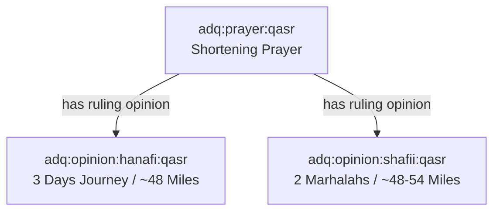

# ADQ Source Authority & Scholarly Conflict Policy

**Phase**: 10B.4C — Knowledge Governance & Content Lifecycle Framework  
**Status**: Architecture & Policy Specification  
**Date**: 2026-07-22  
**Target Path**: `docs/Source-Authority-Policy.md`

---

## 1. Source Authority Hierarchy Matrix

| Authority Class | Source Category | Verification Standard | Weight ($w_{\text{base}}$) | Representation Rule |
|-----------------|-----------------|-----------------------|----------------------------|---------------------|
| **Tier 1: Divine Revelation** | Qur'an (Text & Qira'at) | Mutawatir Consensus | 1.00 | Universal Core Nodes |
| **Tier 1: Prophetic Sunnah** | Sahih & Hasan Hadith | Rigorous Isnad Verification | 0.95–1.00 | Canonical Hadith Nodes |
| **Tier 2: Scholarly Consensus** | Ijma (Consensus) | Classical Consensus Record | 0.90–0.95 | Canonical Principle Nodes |
| **Tier 3: Juristic Analogy** | Qiyas & Classical Fiqh | Recognized Madhhab Text | 0.85–0.90 | Juristic Ruling Nodes |
| **Tier 4: Scholarly Opinions** | Individual Scholar Opinions | Verified Classical Manual | 0.80–0.85 | Scholar-Attributed Nodes |
| **Tier 5: Multidisciplinary** | Science / History / Geography | Empirical / Historical Peer-Review | 0.75–0.85 | Multidisciplinary Nodes |

---

## 2. Plurality & Ikhtilaf (Differing Opinions) Policy

In Islamic jurisprudence, legitimate scholarly differences (*Ikhtilaf*) are a blessing and must be preserved accurately.

### Conflict Resolution Rule: Never Overwrite, Always Branch
When two Madhahib (e.g. Hanafi vs Shafi'i) differ on a legal ruling (e.g., minimum distance for shortening prayer):

Neither opinion overwrites the other. Both exist as distinct, scholar-attributed nodes linked via `has ruling opinion` edges.
