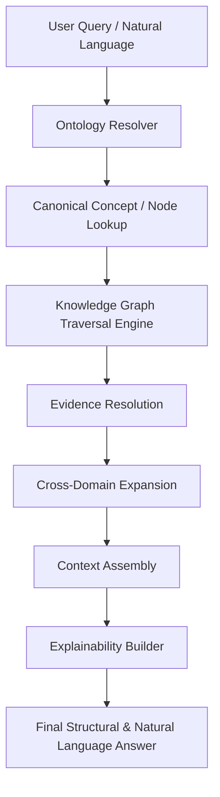

# ADQ Universal Knowledge Query Engine Architecture

**Phase**: 10B.4B — Universal Knowledge Query Engine (Documentation & Design)  
**Status**: Architecture & Design Specification  
**Date**: 2026-07-22  
**Target Path**: `docs/Universal-Query-Engine.md`

---

## 1. Executive Summary & Design Goals

The **Universal Knowledge Query Engine** forms the intelligence interface for the entire ADQ platform. It translates user queries, natural language questions, and programmatic lookups into structured, multi-hop traversals across the Universal Knowledge Graph.

---

## 2. 9-Stage Universal Query Pipeline

1. **Stage 1: User Query Reception**: Accepts natural language, keyphrase, canonical ID (`adq:prayer:fajr`), or term aliases (`salah`, `ramazan`).
2. **Stage 2: Ontology Resolver**: Maps variants using `OntologyResolver` to canonical concepts (`adq:ontology:concept:prayer`).
3. **Stage 3: Canonical Node Resolution**: Resolves primary graph seed nodes from `CanonicalNodeRegistry`.
4. **Stage 4: Knowledge Graph Traversal**: Performs weighted $N$-hop graph traversal (BFS/DFS) via `UniversalKnowledgeGraph`.
5. **Stage 5: Evidence Resolution**: Fetches backed `EvidenceRecord` entries from `EvidenceRegistry` for every traversed node.
6. **Stage 6: Cross-Domain Expansion**: Traverses cross-domain edges generated by `CrossDomainRelationshipBuilder`.
7. **Stage 7: Context Assembly**: Constructs Graph-RAG context payloads containing nodes, relationships, and evidence citations.
8. **Stage 8: Explainability Builder**: Generates deterministic provenance trails, evidence chains, and confidence scores.
9. **Stage 9: Final Answer Rendering**: Formats structured responses for UI rendering, search API JSON, or LLM context windows.

---

## 3. Supported Query Types Matrix

| Query Type | Input Pattern | Traversal Mechanism | Primary Output |
|------------|---------------|---------------------|----------------|
| **Exact Lookup** | `adq:prayer:fajr` | Direct $O(1)$ Hash Map Lookup | Single `UniversalNode` |
| **Semantic / Alias** | `"salah"`, `"ramazan"` | `OntologyResolver` -> Concept | Canonical Node + Aliases |
| **Relationship Traversal** | `nodesConnectedTo('adq:worship:sawm')` | $O(\text{deg}(v))$ Adjacency Traversal | Edge & Target Nodes |
| **Multi-Hop Traversal** | `"How is Fajr tied to Ramadan?"` | 2-3 Hop Weighted Path Traversal | Complete Multi-Hop Path |
| **Evidence Lookup** | `"Citations for Wudu"` | `CitationResolver` -> `EvidenceRecord` | Verified Evidence Chain |
| **"Why" Questions** | `"Why fast in Ramadan?"` | Multi-hop Graph Path + Verses/Hadiths | Structural Provenance |
