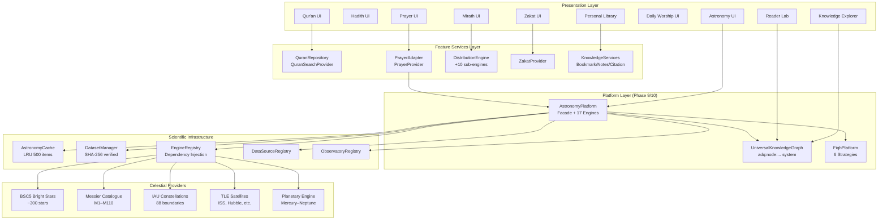
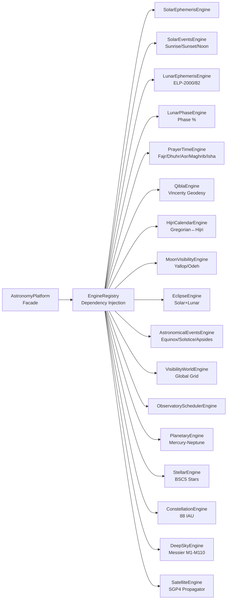
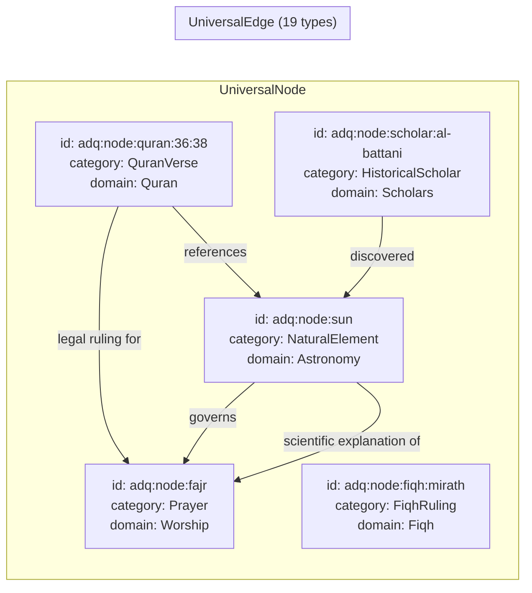
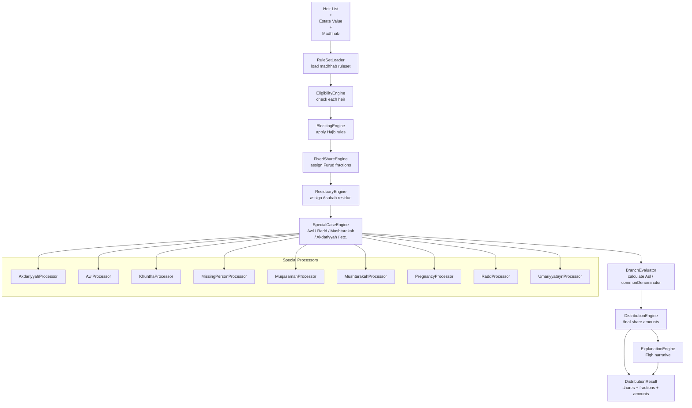
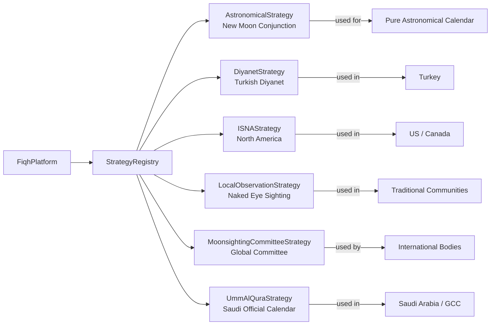
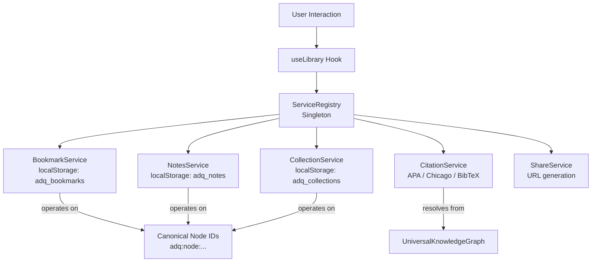
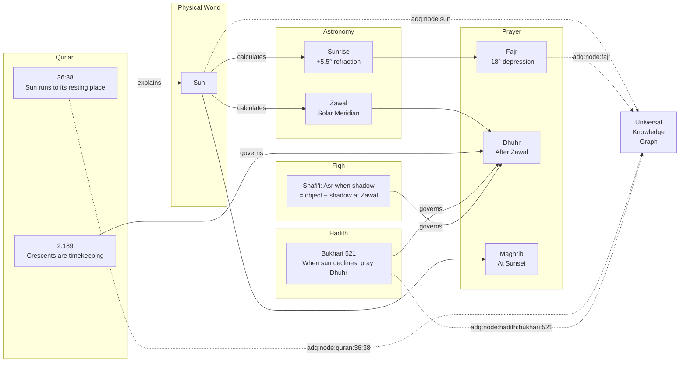

# ADQ Architecture Diagrams

**Phase**: 10B.0.1 — Documentation & Architecture Intelligence  
**Status**: Analysis Only — Zero code modified  
**Date**: 2026-07-22

---

## 1. ADQ Platform Layer Architecture



---

## 2. AstronomyPlatform Engine Registry



---

## 3. Universal Knowledge Graph Model



---

## 4. Mirath Engine Architecture



---

## 5. FiqhPlatform Strategy Registry



---

## 6. Knowledge Services Architecture



---

## 7. Cross-Domain Knowledge Flow



---

## 8. Data Layer Maturity

```
Maturity Level  │  Module              │  Status
────────────────┼──────────────────────┼────────────────────────────
Level 5 (Full)  │  astronomy           │  ✅ Scientific platform complete
Level 4 (Good)  │  mirath              │  ✅ Engine complete, ❌ KG missing
Level 3 (Basic) │  quran               │  ✅ UI + mock, ❌ no full data
Level 3 (Basic) │  zakat               │  ✅ UI + mock, ❌ no engine docs
Level 3 (Basic) │  prayer              │  ✅ UI + adapter, ❌ no tests
Level 3 (Basic) │  knowledge-services  │  ✅ Services, ❌ not wired to KG
Level 2 (Shell) │  knowledge           │  ✅ UI components, mock data only
Level 2 (Shell) │  reader              │  ✅ UI, ❌ no data source
Level 2 (Shell) │  daily-worship       │  ✅ Minimal UI, inline data
Level 1 (UI)    │  hadith              │  ✅ Pages, ❌ no data layer at all
```

---

## 9. Phase Roadmap (Documentation Reference)

```
Phase 9B  ✅  Quran-Astronomy Knowledge Graph + Relationship Engine
Phase 10A ✅  Universal Knowledge Graph Foundation (UniversalNode/Edge/Graph)
Phase 10B.0  ✅  Canonical Repository Audit (all 10 modules inventoried)
Phase 10B.0.1 ✅  Repository Intelligence (this documentation layer)

NEXT:
Phase 10B.1   📋 Quran → Knowledge Graph integration (114 Surahs as nodes)
Phase 10B.2   📋 Hadith → Knowledge Graph (collections, narrators, hadith nodes)
Phase 10B.3   📋 Fiqh → Knowledge Graph (Mirath, Zakat, Prayer as nodes + Madhhab nodes)
Phase 10B.4   📋 Worship → Knowledge Graph (prayers, athkar, sawm)
Phase 10C     📋 Cross-domain explainer (Qur'an ↔ Hadith ↔ Fiqh ↔ Astronomy chains)
Phase 10D     📋 Universal search across all KG domains
Phase 11      📋 Tafsir module foundation
Phase 12      📋 Seerah / Islamic History module
```
