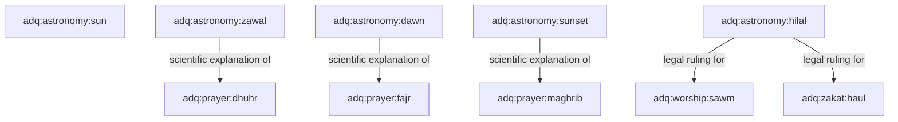

# ADQ Astronomy Relationship Topography Map

**Phase**: 10B.7 — Astronomy Knowledge Domain Expansion  
**Status**: Relationship Specification  
**Date**: 2026-07-22  
**Target Path**: `docs/Astronomy-Relationship-Map.md`

---

## 1. Astronomy Cross-Domain Network

---

## 2. Key Cross-Domain Edges

- `adq:astronomy:dawn -> scientific explanation of -> adq:prayer:fajr` (-18° True Dawn trigger)
- `adq:astronomy:zawal -> scientific explanation of -> adq:prayer:dhuhr` (Meridian transit trigger)
- `adq:astronomy:sunset -> scientific explanation of -> adq:prayer:maghrib` (Full sunset trigger & Iftar)
- `adq:astronomy:hilal -> legal ruling for -> adq:worship:sawm` (Ramadan moonsighting trigger)
- `adq:astronomy:hilal -> legal ruling for -> adq:zakat:haul` (1-year Hawl lunar holding period)
- `adq:astronomy:moon -> part of -> adq:astronomy:lunar-month` (29-30 day lunar cycle)
