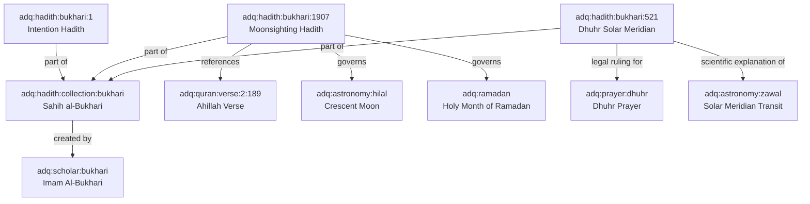

# ADQ Hadith Relationship Specification & Graph Topography Plan

**Phase**: 10B.3A — Hadith Integration Readiness Audit  
**Status**: Relationship Edge Topography Specification  
**Date**: 2026-07-22  
**Target Domain**: `Hadith` (`src/content/hadith/` & `DatasetRegistry`)

---

## 1. Hadith Relationship Network Diagram

---

## 2. Universal Relationship Edge Inventory

### 2.1 Edge `edge:hadith:collection:bukhari->scholar:bukhari`
- **Edge ID**: `edge:hadith:collection:bukhari->scholar:bukhari`
- **Source Node ID**: `adq:hadith:collection:bukhari`
- **Target Node ID**: `adq:scholar:bukhari`
- **Relation Type**: `created by`
- **Narrative**: "Sahih al-Bukhari was compiled and edited by Imam Muhammad ibn Ismail al-Bukhari."
- **Weight**: 1.0
- **Bidirectional**: `false`

### 2.2 Edge `edge:hadith:bukhari:1->collection:bukhari`
- **Edge ID**: `edge:hadith:bukhari:1->collection:bukhari`
- **Source Node ID**: `adq:hadith:bukhari:1`
- **Target Node ID**: `adq:hadith:collection:bukhari`
- **Relation Type**: `part of`
- **Narrative**: "Hadith 1 ('Innamal A'malu bin-Niyyat') is the opening Hadith of Sahih al-Bukhari."
- **Weight**: 1.0
- **Bidirectional**: `false`

### 2.3 Edge `edge:hadith:bukhari:1907->astronomy:hilal`
- **Edge ID**: `edge:hadith:bukhari:1907->astronomy:hilal`
- **Source Node ID**: `adq:hadith:bukhari:1907`
- **Target Node ID**: `adq:astronomy:hilal`
- **Relation Type**: `governs`
- **Narrative**: "Sahih al-Bukhari 1907 establishes naked-eye crescent observation (Hilal) as the primary legal trigger for starting Ramadan."
- **Weight**: 1.0
- **Bidirectional**: `false`
- **Citation**: `Sahih al-Bukhari 1907`

### 2.4 Edge `edge:hadith:bukhari:521->astronomy:zawal`
- **Edge ID**: `edge:hadith:bukhari:521->astronomy:zawal`
- **Source Node ID**: `adq:hadith:bukhari:521`
- **Target Node ID**: `adq:astronomy:zawal`
- **Relation Type**: `scientific explanation of`
- **Narrative**: "Sahih al-Bukhari 521 links the entry time of Dhuhr prayer to the solar zenith transit (Zawal)."
- **Weight**: 1.0
- **Bidirectional**: `false`
- **Citation**: `Sahih al-Bukhari 521`

---

## 3. Validation Verification

1. All endpoint node IDs exist or are defined in platform initializers.
2. Edge weights are bounded within [0.0, 1.0].
3. Zero directional cycles are introduced.
