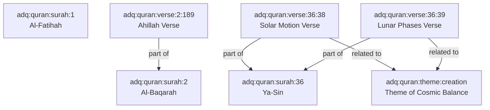

# ADQ Qur'an Relationship Specification & Graph Topography Plan

**Phase**: 10B.2A — Qur'an Integration Readiness Audit  
**Status**: Relationship Edge Topography Specification  
**Date**: 2026-07-22  
**Target Domain**: `Qur'an` (`src/features/quran/`)

---

## 1. Internal Qur'anic Relationships (Surah ↔ Ayah ↔ Theme)

---

## 2. Universal Relationship Edge Inventory

### 2.1 Edge `edge:quran:verse:36:38->astronomy:sun`
- **Edge ID**: `edge:quran:verse:36:38->astronomy:sun`
- **Source Node ID**: `adq:quran:verse:36:38`
- **Target Node ID**: `adq:astronomy:sun`
- **Relation Type**: `scientific explanation of`
- **Narrative**: "Qur'an 36:38 describes the Sun running on its designated trajectory toward its stopping point, aligning with astronomical solar motion."
- **Weight**: 1.0
- **Bidirectional**: `false`
- **Citation**: `Qur'an 36:38`

### 2.2 Edge `edge:quran:verse:36:39->astronomy:moon`
- **Edge ID**: `edge:quran:verse:36:39->astronomy:moon`
- **Source Node ID**: `adq:quran:verse:36:39`
- **Target Node ID**: `adq:astronomy:moon`
- **Relation Type**: `scientific explanation of`
- **Narrative**: "Qur'an 36:39 establishes that the Moon has predetermined orbital phases (Manazil)."
- **Weight**: 1.0
- **Bidirectional**: `false`
- **Citation**: `Qur'an 36:39`

### 2.3 Edge `edge:quran:verse:2:189->astronomy:hilal`
- **Edge ID**: `edge:quran:verse:2:189->astronomy:hilal`
- **Source Node ID**: `adq:quran:verse:2:189`
- **Target Node ID**: `adq:astronomy:hilal`
- **Relation Type**: `legal ruling for`
- **Narrative**: "Qur'an 2:189 answers inquiries regarding the new moons (Ahillah), declaring them measurements of time for humans and Hajj."
- **Weight**: 1.0
- **Bidirectional**: `false`
- **Citation**: `Qur'an 2:189`

### 2.4 Edge `edge:quran:verse:2:189->ramadan`
- **Edge ID**: `edge:quran:verse:2:189->ramadan`
- **Source Node ID**: `adq:quran:verse:2:189`
- **Target Node ID**: `adq:ramadan`
- **Relation Type**: `governs`
- **Narrative**: "Qur'an 2:189 establishes new moon sighting as the legal trigger governing the start of sacred Islamic months."
- **Weight**: 1.0
- **Bidirectional**: `false`

### 2.5 Edge `edge:quran:verse:3:96->place:makkah`
- **Edge ID**: `edge:quran:verse:3:96->place:makkah`
- **Source Node ID**: `adq:quran:verse:3:96`
- **Target Node ID**: `adq:place:makkah`
- **Relation Type**: `references`
- **Narrative**: "Qur'an 3:96 establishes Bakkah (Makkah) as the location of the first House of Worship built for humanity."
- **Weight**: 1.0
- **Bidirectional**: `false`
- **Citation**: `Qur'an 3:96`

---

## 3. Validation Verification

1. All source nodes (`adq:quran:...`) and target nodes (`adq:astronomy:sun`, `adq:astronomy:moon`, `adq:astronomy:hilal`, `adq:ramadan`, `adq:place:makkah`) exist or are defined in platform initializers.
2. All weights are within [0.0, 1.0].
3. Zero directional cycles are introduced.
