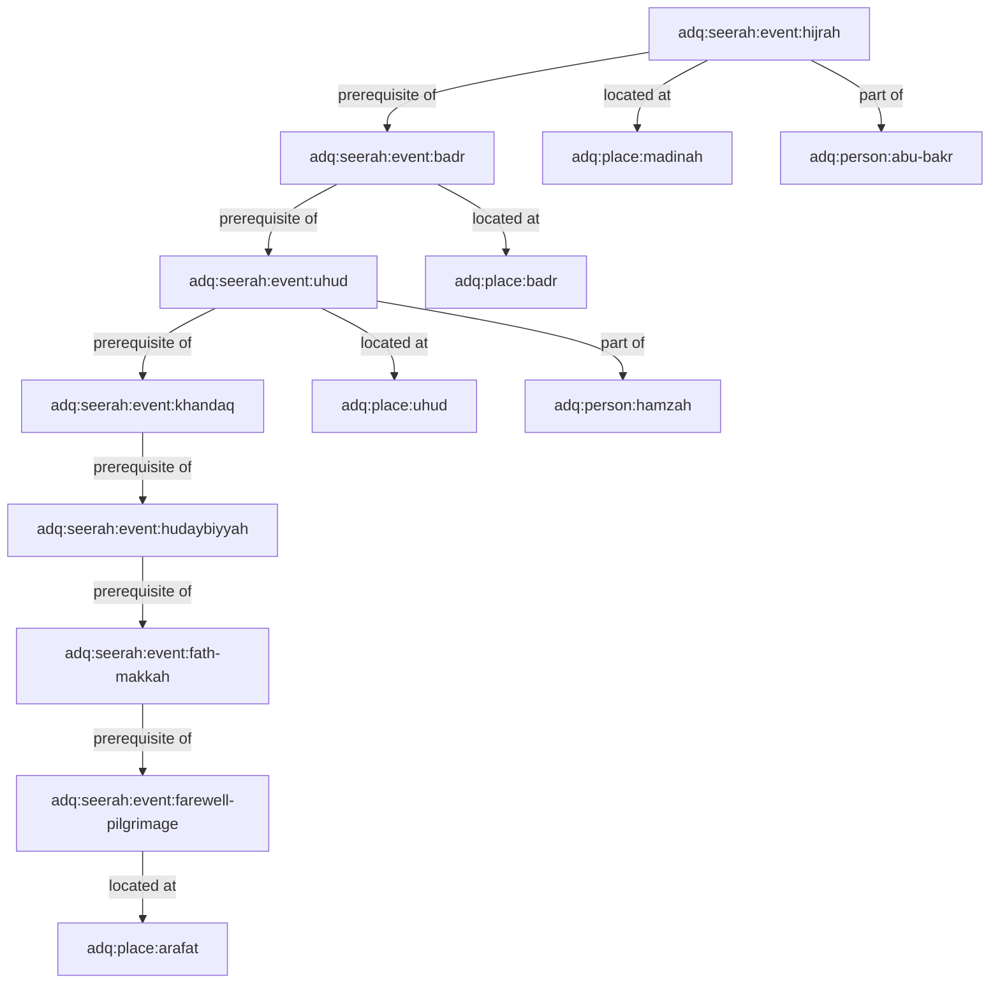

# ADQ Seerah Relationship Map Specification

**Phase**: 10B.8 — Seerah Knowledge Domain Integration (Experience-Oriented)  
**Status**: Relationship Topography Specification  
**Date**: 2026-07-22  
**Target Path**: `docs/Seerah-Relationship-Map.md`

---

## 1. Multi-Domain Seerah Relationship Graph

