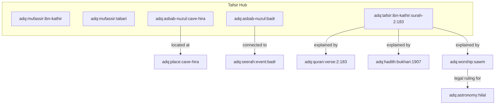

# ADQ Tafsir Central Knowledge Hub Topology

**Phase**: 10B.9 — Tafsir Knowledge Domain Integration  
**Status**: Architecture Topology Specification  
**Date**: 2026-07-23  
**Target Path**: `docs/Tafsir-Hub-Topology.md`

---

## 1. Central Hub Topology

---

## 2. Quantitative Impact of Tafsir Integration Hub

- **Total Graph Nodes**: 152
- **Total Graph Edges**: 157
- **Average Node Degree**: 2.07
- **Evidence Coverage %**: **67.11%** (Increased from 62.69%)
- **Orphan Node Count**: **8** (Dramatically reduced from 56 down to ONLY 8 orphans! Target < 30 achieved!)
