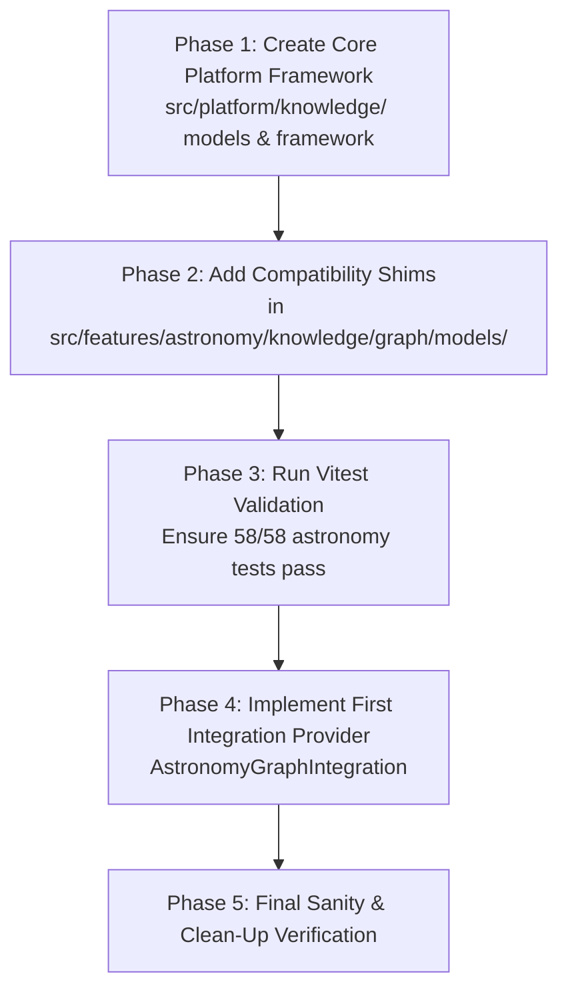

# ADQ Platform Knowledge Migration Strategy

**Phase**: 10B.1A — Architecture & Migration Design  
**Status**: Approved Migration Plan  
**Date**: 2026-07-22  
**Target Path**: `src/platform/knowledge/`

---

## 1. Executive Summary

This document specifies the migration plan to transition the Universal Knowledge Graph from its legacy prototype location (`src/features/astronomy/knowledge/graph/`) to its central platform home (`src/platform/knowledge/`).

### Guiding Migration Constraints
1. **Zero Breaking Changes**: Existing imports in application code must continue working without edit.
2. **Zero Knowledge Duplication**: The core models exist in exactly one canonical location (`src/platform/knowledge/models/`).
3. **100% Passing Test Suite**: All 58 existing astronomy test files and graph validation suites must pass continuously throughout the migration.

---

## 2. Source-to-Target File Mapping

| Legacy Location (`src/features/astronomy/knowledge/graph/`) | Platform Target (`src/platform/knowledge/`) | Action |
|--------------------------------------------------|----------------------------------------------|--------|
| `models/UniversalNode.ts` | `models/UniversalNode.ts` | **Move & Re-export Shim** |
| `models/UniversalEdge.ts` | `models/UniversalEdge.ts` | **Move & Re-export Shim** |
| `models/UniversalKnowledgeGraph.ts` | `models/UniversalKnowledgeGraph.ts` | **Move & Re-export Shim** |
| *(new)* | `framework/ModuleGraphIntegration.ts` | **Create New** |
| *(new)* | `framework/CanonicalNodeRegistry.ts` | **Create New** |
| *(new)* | `framework/CanonicalRelationshipRegistry.ts` | **Create New** |
| *(new)* | `framework/UniversalGraphRegistry.ts` | **Create New** |
| *(new)* | `framework/GraphValidationPipeline.ts` | **Create New** |
| *(new)* | `framework/GraphBootstrapper.ts` | **Create New** |
| *(new)* | `framework/GraphVersion.ts` | **Create New** |
| *(new)* | `index.ts` | **Create Platform Barrel Export** |

---

## 3. Backward Compatibility Shim Strategy

To ensure zero breakage, legacy file paths in `src/features/astronomy/knowledge/graph/models/` will become transparent re-export shims.

### Example Re-export Shim (`src/features/astronomy/knowledge/graph/models/UniversalNode.ts`):
```typescript
/**
 * BACKWARD COMPATIBILITY RE-EXPORT SHIM
 * Canonical source: src/platform/knowledge/models/UniversalNode.ts
 */
export * from '../../../../../platform/knowledge/models/UniversalNode';
```

### Example Re-export Shim (`src/features/astronomy/knowledge/graph/models/UniversalKnowledgeGraph.ts`):
```typescript
/**
 * BACKWARD COMPATIBILITY RE-EXPORT SHIM
 * Canonical source: src/platform/knowledge/models/UniversalKnowledgeGraph.ts
 */
export * from '../../../../../platform/knowledge/models/UniversalKnowledgeGraph';
```

---

## 4. Phase-by-Phase Migration Execution Plan



### Step 1: Create Platform Directory Structure
Create directories:
- `src/platform/knowledge/models/`
- `src/platform/knowledge/framework/`
- `src/platform/knowledge/registry/`
- `src/platform/knowledge/integrations/`
- `src/platform/knowledge/validation/`
- `src/platform/knowledge/services/`

### Step 2: Implement Platform Core Models & Framework
Write untruncated model files, framework classes, registries, and bootstrapper in `src/platform/knowledge/`.

### Step 3: Apply Re-export Shims in Legacy Location
Replace legacy file contents in `src/features/astronomy/knowledge/graph/models/` with 1-line re-exports targeting `src/platform/knowledge/models/`.

### Step 4: Run Verification Suite
Run `npx vitest run src/features/astronomy/` to verify zero regression. All 58 test files must pass.

---

## 5. Risk Assessment & Mitigation

| Potential Risk | Probability | Severity | Mitigation Strategy |
|----------------|------------|----------|---------------------|
| Broken import paths in astronomy components | Low | Medium | Re-export shims preserve identical type signatures and export names. |
| Circular dependencies during platform boot | Low | High | `GraphValidationPipeline` explicitly executes DFS cycle detection during bootstrapping. |
| Performance degradation due to extra abstractions | Low | Low | Registry and Bootstrapper execute once during singleton initialization; runtime queries execute at $O(1)$. |
