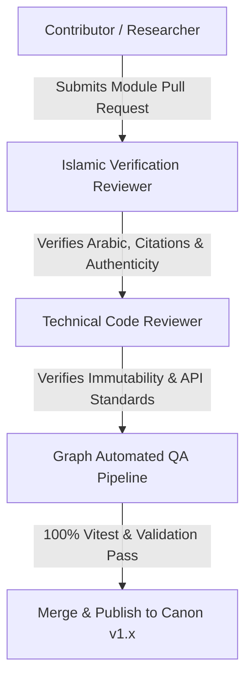

# ADQ Publication Workflow & Future Expansion Policy

**Phase**: 10B.4C — Knowledge Governance & Content Lifecycle Framework  
**Status**: Architecture & Design Specification  
**Date**: 2026-07-22  
**Target Path**: `docs/Publication-Workflow.md`

---

## 1. Contributor Review & Approval Workflow



### Stage Responsibilities
1. **Authoring Stage**: Contributor authors integration module adhering to `Module-Development-Standard.md`.
2. **Islamic Verification**: Reviewer verifies Arabic text accuracy, tafsir attribution, hadith grading, and scholar names.
3. **Technical Validation**: Code reviewer ensures `adq:<module>:<type>:<id>` ID format, no hardcoded text arrays, and `Object.freeze` immutability.
4. **Automated Graph QA**: CI/CD runs Vitest validation pipeline checking node uniqueness, evidence linking, and cycle detection.
5. **Publication**: Automatic tagging and release of compiled graph chunk.

---

## 2. Future Domain Expansion Standards

Future modules MUST follow assigned priority tiers:

```
Tier 100-199: Revelation Core (Quran, Hadith)
Tier 200-299: Devotional & Jurisprudence (Prayer, Worship, Mirath, Zakat, Fiqh)
Tier 300-399: Humanities & History (Seerah, History, Geography, Scholars)
Tier 400-499: Language & Exegesis (Arabic, Tafsir, Aqeedah)
Tier 500-599: Natural Sciences & Multidisciplinary (Astronomy, Biology, Physics, Mathematics, Medicine)
```
