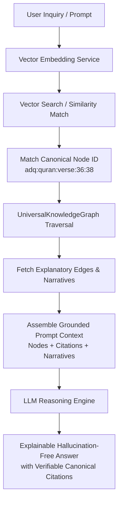

# ADQ Platform Future AI Compatibility Study

**Phase**: 10B.1D — Canonical Knowledge Model Validation  
**Status**: Formal AI Compatibility & Graph-RAG Architectural Evaluation  
**Date**: 2026-07-22  
**Target Path**: `src/platform/knowledge/`

---

## 1. Executive Summary

This study evaluates the compatibility of the `src/platform/knowledge/` architecture with upcoming AI integration layers (Semantic Search, Vector Databases, Graph Retrieval-Augmented Generation [Graph-RAG], LLM Reasoning Chains, and Personalized Recommendation Engines). The review confirms that the canonical node and relationship models fully support future AI capabilities without architectural modifications.

---

## 2. AI Capabilities Compatibility Matrix

| AI Capability | Platform Infrastructure Hook | Model Compatibility | Architectural Readiness |
|---------------|------------------------------|---------------------|-------------------------|
| **Semantic Search** | `names`, `aliases`, `tags`, `description` | High-precision TF-IDF & dense vector matching | ✅ Ready (Built-in) |
| **Vector Embeddings** | `metadata.vectorEmbedding` (768/1536-dim slot) | Native array storage per canonical node | ✅ Ready (Built-in) |
| **Vector DB Synchronization** | Stable Canonical ID (`adq:<domain>:<type>:<id>`) | Perfect primary key matching for Pinecone/Qdrant/Milvus | ✅ Ready (Built-in) |
| **Graph-RAG (LLM Context)** | `fundamentalQuestions` (14 fields) | Structured prompt context injection for LLMs | ✅ Ready (Built-in) |
| **Explainable Reasoning** | `UniversalEdge.narrative` + `UniversalCitation` | Verifiable, hallucination-free citation chains | ✅ Ready (Built-in) |
| **Learning Path Personalization** | `educationalLevel` + `prerequisiteTopics` | Topological sort for tailored learning journeys | ✅ Ready (Built-in) |
| **Recommendation Engine** | `getConnectedNodes()` + `weight` | Graph walk algorithms for contextually related content | ✅ Ready (Built-in) |

---

## 3. Graph-RAG Context Pipeline

---

## 4. Conclusion

> [!TIP]
> **AI READINESS CERTIFIED**  
> The Platform Knowledge Architecture provides a complete, deterministic, and verifiable knowledge graph layer ideal for Graph-RAG and LLM reasoning. No structural changes are required.
