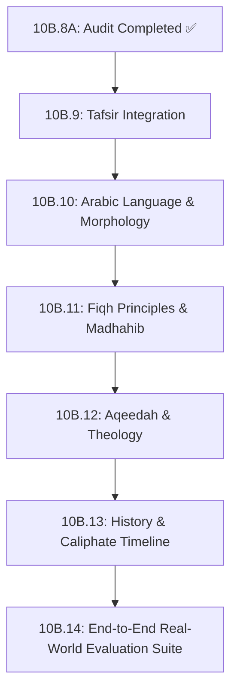

# ADQ Knowledge Roadmap v2.0 (Post-Audit Strategy)

**Phase**: 10B.8A — Knowledge Coverage & Quality Audit  
**Date**: 2026-07-23  
**Status**: Strategic Roadmap Update  
**Target Path**: `docs/Knowledge-Roadmap-v2.md`

---

## 1. Quality & Audit Findings Integration Plan

Based on the empirical audit of the 134-node Universal Knowledge Graph, future domain expansions will explicitly address identified relationship and evidence gaps while bringing in new core knowledge domains.

---

## 2. Updated Sequence of Deliverables

---

## 3. Detailed Phase Objectives

### Phase 10B.9 — Tafsir Knowledge Domain Integration
- **Classical Mufassirun**: Ibn Kathir, Al-Tabari, Al-Qurtubi, Al-Razi, Al-Sa'di.
- **Hermeneutic Methodologies**: *Tafsir bil-Ma'thur* (exegesis by tradition) vs *Tafsir bil-Ra'y* (exegesis by reasoned inquiry).
- **Asbab al-Nuzul**: Occasions of revelation linking verses directly to Seerah events.
- **Interconnected Hub**: Tafsir will connect Qur'an Verses, Hadith, Seerah Events, and Fiqh Rulings into the single most interconnected domain in ADQ.

### Phase 10B.10 — Arabic Language & Morphology
- Roots (`Root: ك-ت-ب`, `س-ل-م`), Grammar (*I'rab*), Morphological forms (*Wazn*).

### Phase 10B.11 — Fiqh Principles & Madhahib
- *Usul al-Fiqh* (Legal Maxims / *Qawa'id Fiqhiyyah*) and juristic school comparison matrices (Hanafi, Maliki, Shafi'i, Hanbali).

### Phase 10B.12 — Aqeedah & Theology
- Pillars of Iman, Asma-ul-Husna, and foundational theological concepts.

### Phase 10B.13 — History & Timeline
- Rashidun Caliphate, Umayyad/Abbasid eras, and Islamic scholarship evolution.

### Phase 10B.14 — Real-World Evaluation Suite
- Benchmarking complex queries ("When does fasting begin?", "Who inherits if someone dies leaving a wife and two daughters?") to verify end-to-end Graph-RAG retrieval and explainability trails.
