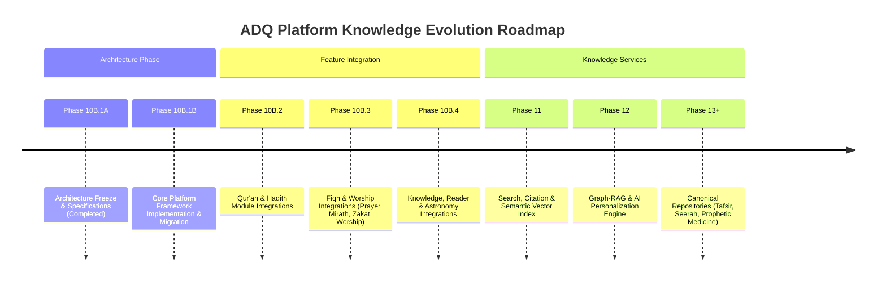

# ADQ Platform Knowledge Roadmap (Phases 10B.1A – 15+)

**Phase**: 10B.1A — Architecture Design & Platform Roadmap  
**Status**: Approved Multi-Phase Roadmap  
**Date**: 2026-07-22  
**Target Path**: `src/platform/knowledge/`

---

## 1. Roadmap Overview & Timeline

---

## 2. Phase Breakdown & Scope

### Phase 10B.1A: Architecture Design & Freeze (CURRENT — COMPLETE)
- Complete design review of `src/platform/knowledge/`.
- Definition of 3 Core Rules (Future Module Rule, Stable Node ID Standard, Node Immutability Rule).
- Authoring of 5 architectural intelligence documents in `docs/`.

### Phase 10B.1B: Core Framework Implementation & Platform Migration
- Build `src/platform/knowledge/` models, registries, framework, versioning, and validation pipeline.
- Implement compatibility re-export shims in `src/features/astronomy/knowledge/graph/models/`.
- Add automated test suite `PlatformKnowledgeFramework.test.ts`.
- Verify 100% test suite pass rate across 58 astronomy tests.

### Phase 10B.2: Revelation Layer Integration (Quran & Hadith)
- Build `QuranGraphIntegration` & `HadithGraphIntegration`.
- Ingest Surahs, Ayahs, Hadith collections (`bukhari`, `muslim`), and narrators as canonical nodes (`adq:quran:surah:N`, `adq:hadith:bukhari:N`).
- Connect Qur'an verses to Hadith evidences.

### Phase 10B.3: Fiqh & Worship Integration (Prayer, Mirath, Zakat, Daily Worship)
- Build `PrayerGraphIntegration`, `MirathGraphIntegration`, `ZakatGraphIntegration`, and `WorshipGraphIntegration`.
- Map 5 prayers, Wudu, Qibla, Fara'id heirs/shares, Awl, Radd, Nisab, Athkar, Fasting into canonical nodes.
- Connect Fiqh rulings to Qur'anic & Hadith foundations.

### Phase 10B.4: Presentation & Science Integration (Knowledge, Reader, Astronomy)
- Build `KnowledgeModuleGraphIntegration`, `ReaderGraphIntegration`, and `AstronomyGraphIntegration`.
- Map scientific glossary, astronomical bodies, and interactive topics into canonical nodes.
- Execute full 9-module cross-domain relationship builder.

### Phase 11: Platform Search & Vector Indexing (`src/platform/knowledge/services/`)
- Build `VectorSearchService` and `SemanticIndexService`.
- Generate 768-dim embeddings for all canonical nodes.

### Phase 12: Graph-RAG AI & Learning Personalization
- Build LLM Graph-RAG pipeline for explainable AI answers based strictly on canonical node references.
- Implement adaptive learning paths across disciplines.

### Phase 13+: Expanded Canonical Repositories
- Systematically ingest new domain modules (Tafsir, Seerah, Prophetic Medicine, Islamic History, Arabic Linguistics, etc.) following the `ModuleGraphIntegration` standard.

---

## 3. Final Architectural Recommendation & Approval Conclusion

> [!TIP]
> ### Architectural Recommendation & Approval Status
> **APPROVED AS-IS — NO FURTHER CHANGES REQUIRED**  
> 
> The platform architecture specified under `src/platform/knowledge/` is hereby formally frozen and approved. It provides a robust, scalable, AI-ready, and strictly governed foundation for ADQ's growth over the next decade.
> 
> **Next Immediate Action**: Proceed to Phase 10B.1B (Framework Implementation & Platform Core Migration) when ready.
